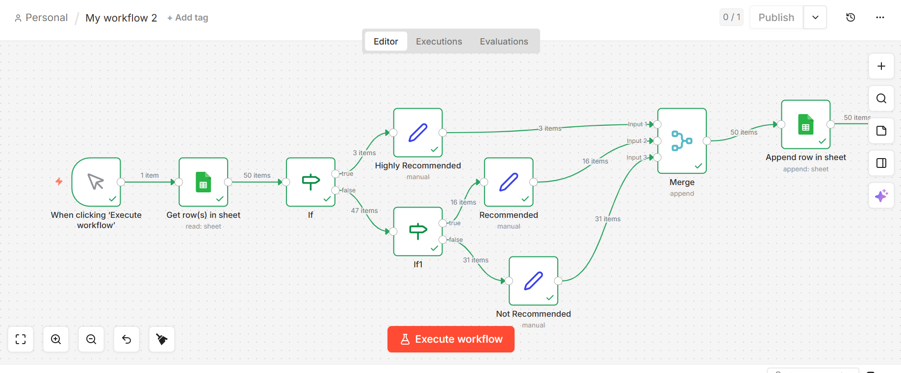
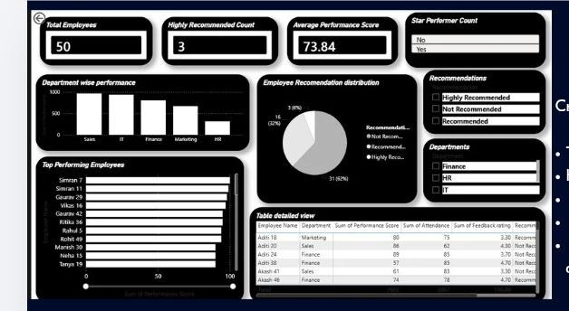

# Employee Performance Automation (n8n)

## 📌 Project Overview

This project uses n8n to automate employee performance evaluation.

It reads employee data from Google Sheets and categorizes employees into:

* Highly Recommended
* Recommended
* Not Recommended

---

## 🧠 Logic Used

### ⭐ Highly Recommended

* Performance Score > 85
* Attendance > 90

### 👍 Recommended

* Performance Score between 70 and 85

### ❌ Not Recommended

* Remaining employees

---

## 🔄 Workflow Steps

1. Read data from Google Sheets
2. Apply conditions using IF nodes
3. Categorize employees
4. Merge results
5. Save to Google Sheets

---

## 📸 Screenshots

### Workflow



### Dashboard



---

## 🚀 How to Run

1. Install n8n:

```
npm install n8n -g
```

2. Start n8n:

```
n8n
```

3. Open browser:

```
http://localhost:5678
```

4. Import workflow.json
5. Connect Google Sheets
6. Click Execute Workflow

---

## 🎯 Features

* Automation using n8n
* Real-time data processing
* Decision making using conditions

---

## 🙌 Author

Snehasri Dey
